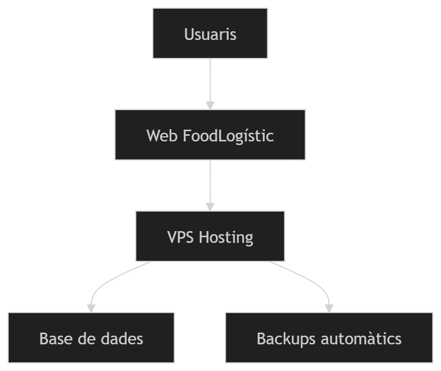
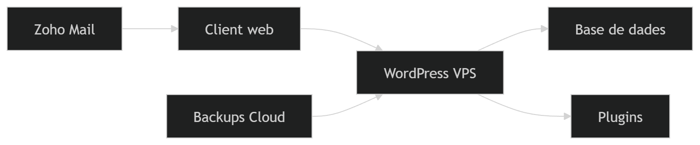
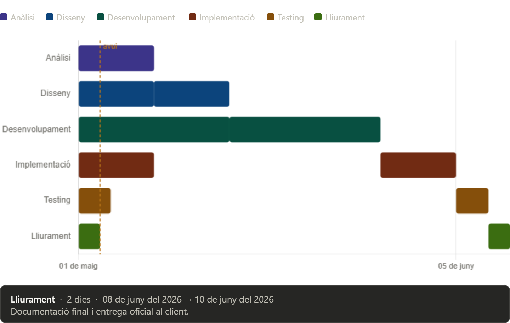

# 📄 P01 – Memòria tècnica de la proposta  
**Client:** FoodLogístic S.A.  

---

## 1. Introducció

Aquest document presenta la proposta tècnica per al desenvolupament d’una solució digital per a **FoodLogístic S.A.**, que inclou:

- Pàgina web corporativa
- Infraestructura al núvol
- Sistema de correu empresarial
- Serveis de manteniment i seguretat

L’objectiu és modernitzar la infraestructura digital de l’empresa, millorant:

- Comunicació interna i externa
- Seguretat de dades
- Escalabilitat del sistema
- Presència digital corporativa

---

## 2. Anàlisi de necessitats

### 2.1 Problemes detectats

| Àrea | Problema |
|------|----------|
| Comunicació | Correu poc centralitzat |
| Infraestructura | Dependència de sistemes locals |
| Seguretat | Protecció insuficient |
| Presència web | Web poc moderna o inexistent |

---

### 2.2 Necessitats del client

- Sistema de correu corporatiu segur
- Web corporativa moderna i escalable
- Hosting fiable i flexible
- Sistema de còpies de seguretat
- Compliment LOPD / RGPD

---

## 3. Proposta de solució

### 3.1 Infraestructura i alta disponibilitat

Es proposa una arquitectura basada en:

- VPS al núvol (hosting web)
- WordPress com a CMS
- Sistema de backups automatitzats
- Escalabilitat vertical del servidor

Avantatges:
- Alta disponibilitat
- Cost reduït
- Escalabilitat fàcil

---

### Arquitectura del sistema

---

### 3.2 Serveis al núvol

S’ha seleccionat:

- Zoho Workplace per correu i col·laboració

Serveis inclosos:
- Correu corporatiu
- Calendari compartit
- Emmagatzematge al núvol
- Eines ofimàtiques

---

### 3.3 Seguretat i LOPD

| Mesura | Descripció |
|--------|------------|
| MFA | Autenticació multifactor |
| Xifrat | Dades en trànsit i repòs |
| Backups | Còpies automàtiques |
| Control accés | Permisos per rols |

---

### 3.4 Presència web

Tecnologia utilitzada:

- WordPress (CMS)
- Tema professional de ThemeForest
- Plugins de seguretat i SEO

Objectius:
- Millorar imatge corporativa
- Captació de clients
- Informació de serveis

---

## 4. Arquitectura i disseny tècnic

### 4.1 Diagrama general

---

### 4.2 Tecnologies utilitzades

| Àrea | Tecnologia |
|------|-----------|
| Web | WordPress |
| Hosting | VPS Linux |
| Correu | Zoho Workplace |
| Seguretat | Wordfence |
| Backups | UpdraftPlus |

---

## 5. Pressupost

| Concepte | Cost |
|----------|------|
| Implantació inicial | 2.060 € |
| Cost mensual | 187 €/mes |

---

## 6. Planificació

### 6.1 Fases del projecte

| Fase | Durada | Tasques |
|------|--------|--------|
| Anàlisi | 1 setmana | Requisits |
| Disseny | 1 setmana | UX/UI |
| Desenvolupament | 2 setmanes | Web + VPS |
| Implementació | 1 setmana | Serveis |
| Testing | 3 dies | Proves |
| Lliurament | 2 dies | Documentació |

---

### 6.2 Cronograma

---

## 7. Conclusions

La proposta per a FoodLogístic S.A.:

- És escalable i moderna
- Millora la seguretat i comunicació
- Redueix costos recurrents
- Permet creixement futur

Resultat:
- Web corporativa professional
- Sistema de correu al núvol
- Infraestructura segura i eficient
