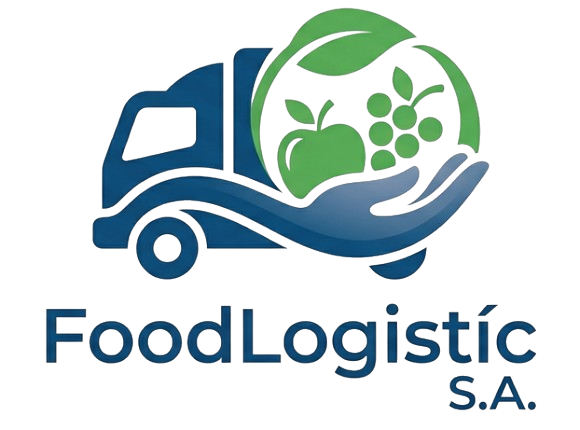

# projecte FoodLogistic

## Modernització de la logística alimentària a través de la tecnologia

## Autor

Nom: Pol Castaño Meneses

Formant grups de treball: Biel.B i Pol.C

## Descripció del projecte

"FoodLogístic S.A." és una empresa capdavantera en la distribució i logística alimentària a nivell nacional. Arran de l'obertura de noves rutes i la contractació de més personal, el seu volum de dades i les seves necessitats de comunicació s'han multiplicat.

La seva infraestructura actual s'ha quedat petita i pateixen per la seguretat i la continuïtat del negoci. Han contactat amb la vostra empresa informàtica perquè els ajudeu a modernitzar-se. Us demanen actuar en tres àrees clau:

Al Moodle teniu l'enllaç al document amb l'enunciat del projecte.

### Dades legals i corporatives de "FoodLogistic S.A."

- **Raó social:** FoodLogistic S.A.
- **NIF:** A08123456
- **Adreça:**  Carrer de la Teixidora, núm. 13, 08302 Mataró Barcelona.
- **Inscripció Registral:** Inscrita al Registre Mercantil de Barcelona, Tom 45678, Foli 120, Full B-567890, Inscripció 1a.
- **Correu electrònic de contacte:** <info@foodlogistic.com>
- **Telèfon:** +34 935 55 55 55
- **Nombre de treballadors:** 35
- **Facturació darrer any:** 25 milions d’euros.

## Contingut del Projecte

- [**Tasca 1 (T01)**](./T01)
- [**Tasca 2 (T02)**](./T02)
- [**Tasca 3 (T03)**](./T03)
- [**Tasca 4 (T04)**](./T04)
- [**Tasca 5 (T05)**](./T05)
- [**Tasca 6 (T06)**](./T06)
- [**Tasca 7 (T07)**](./T07)
- [**Tasca 8 (T08)**](./T08)
- [**Tasca 9 (T09)**](./T09)
- [**Tasca 10 (T10)**](./T10)
- [**Producte 1 (P01)**](./P01)
- [**Producte 2 (P02)**](./P02)

## Guies Git i GitHub

- [Introducció a Git i GitHub](https://github.com/SMX2n/IntroGitHub)
- [Control de versions: Git](https://github.com/SMX2n/ControlVersions)
- [Guia GitHub Classroom](https://github.com/SMX2n/guia-github-classroom)

Bona sort! 🚀
