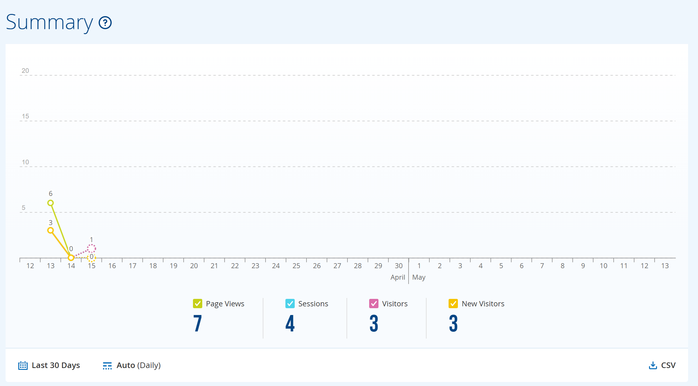

# Creant la proposta de la pàgina corporativa

## 📄 Descripció del projecte

FoodLogistic ha detectat la necessitat urgent de renovar la seva presència digital per adaptar-se als estàndards actuals tant en l’àmbit tècnic com legal. L’actual pàgina web presenta limitacions importants: un disseny obsolet, mancances funcionals i l’incompliment de normatives vigents com la LOPDGDD i la LSSI-CE.

Davant d’aquesta situació, l’empresa sol·licita una proposta de millora que no només sigui teòrica, sinó que inclogui una demostració pràctica i funcional. Per aquest motiu, es requerirà el desenvolupament i desplegament d’un nou lloc web en un servidor real, permetent així visualitzar de manera fidel la nova identitat digital de FoodLogistic.

En aquesta activitat, es posaran en pràctica els coneixements adquirits en la guia de desplegament, amb l’objectiu d’assolir tres punts clau: la modernització de la imatge corporativa online, el compliment de la normativa legal vigent i la publicació efectiva del projecte en un entorn real accessible.

---

## 🔗 Enllaç del repositori personal

[Repositori Personal](https://github.com/Pol-FP/demo-web.git)

---

## 🌐 URL de la pàgina

[Pàgina Web](https://pol-fp.github.io/demo-web/)

---

## 📊 Control i Analítica (StatCounter)

S’ha implementat correctament **StatCounter** a la pàgina web mitjançant un comptador invisible, assegurant que es registren les visites reals dels usuaris sense afectar la interfície visual.

### ✔️ Implementació
El codi de seguiment de StatCounter s’ha integrat dins del codi HTML de la pàgina, permetent registrar l’activitat dels visitants.

### 📸 Evidències de funcionament
A continuació es mostren captures reals del panell de StatCounter on es poden veure les visites registrades:

### 📈 Dades recollides
StatCounter proporciona informació detallada com ara:
- Nombre de visites i usuaris
- Pàgines més visitades
- Dispositiu utilitzat (mòbil, ordinador, tauleta)
- Navegador i sistema operatiu
- Ubicació aproximada dels visitants

Això permet analitzar el comportament dels usuaris i entendre millor com interactuen amb la web.

---